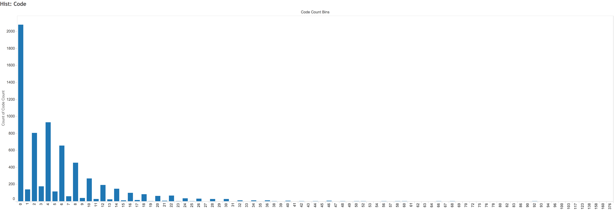

# Evaluation 60: Even-number bias of code block counts NPM READMEs

## Overview

### Questions

In running [Prototype 18](../proto/proto18) on READMEs from around 7,000 NPM packages, I saw an unexpected trend:

This graphic was created from the Prototype 18 data using Tableau.
See the file `data/exploratory-random.twb` in the Prototype 18 folder.

The phenomenon I observed was that only a small fraction of the READMEs queried had an odd number of code examples.
This seems strange.
While we expect the roughly exponential decline relationship we see in the number of code blocks and their frequency,
there is no obvious reason to explain why there is more likely to be an even number of code examples than an odd number.

The question I answer here is:
* Do the READMEs that are reported as having an even number of code blocks *actually* have an even number of code blocks?
* Same question, but for READMEs reported as having an odd number of code blocks

If not, then I need to revisit the code that performs the analysis of counting code blocks and fix it.

### Results

I produce two findings about how we compute code blocks for the READMEs:
* Many of the READMEs are wrongly marked by the `analysis.py` script in [Prototype 18](../proto/proto18) as having two code blocks instead of one
* The `analysis.py` script in Prototype 18 needlessly renders README scripts from Markdown to HTML, when they are HTML when we scrape them.  This may add additional markup to the READMEs.
* The NPM webpage renderer likely inserts additional levels of the `pre` tag for code blocks in Markdown scripts.  I suspect this might be performed by `highlight.js`, which NPM may be using for their syntax highlighting.

My long-term recommendation to solve this problem is to fetch READMEs in Markdown form directly from the NPM registry.
More immediately, to make the `analysis.py` script produce more accurate counts, it should **not** read the READMEs as Markdown but instead as HTML (which is the form they were downloaded in).
In addition, in light of the pattern that I observed anecdotally where code blocks may include multiple layers of `pre`, a selector should be used to choose only `pre` blocks that aren't already encapsulated in other `pre` blocks.
It's likely that other sites that render the Markdown README also perform inconvenient transformations on READMEs.

## Procedure

This requires access to the packages.db sqlite database.
As this is a very large file (gigabytes), I stored it on Google Drive at [this link](https://drive.google.com/a/berkeley.edu/file/d/0B5xvBAe33kJka3NEQ0k2OGpsN3c/view?usp=sharin://drive.google.com/a/berkeley.edu/file/d/0B5xvBAe33kJka3NEQ0k2OGpsN3c/view?usp=sharing).
You will want to download it from there before running any of the following analysis.

### Expectation

I find out that in fact there is a bug somewhere in the code.
Of the random sample of READMEs that have two code examples in them, I find that about half actually have an odd number of examples.

### Sqlite Verfication of trend

First, in sqlite I run a query to group the READMEs by the number of lines of code.
Because I currently only have the data for all 200,000 packages from the scrape, I work with this data instead of the 7,000.
I verify sqlite shows this same relationship of relatively few code examples with an even number of code examples.

    SELECT code_count, COUNT(code_count) FROM readmeanalysis GROUP BY code_count;

The results are as follows.
The table has been truncated after a code block count of 100 for the sake of brevity.
Even in the sqlite data, we can still see that there's a tendency for there to be many more examples of READMEs with an even number of code blocks.

Code block count|Frequency
----------|---------
0|65029
1|4999
2|26095
3|5900
4|29794
5|3294
6|20520
7|2001
8|13484
9|1324
10|9508
11|938
12|6254
13|640
14|4590
15|505
16|3458
17|356
18|2547
19|291
20|1836
21|237
22|1509
23|202
24|1203
25|134
26|976
27|107
28|863
29|98
30|627
31|88
32|544
33|83
34|478
35|49
36|425
37|53
38|311
39|49
40|270
41|36
42|247
43|34
44|224
45|37
46|180
47|54
48|177
49|19
50|145
51|33
52|130
53|23
54|120
55|24
56|107
57|13
58|108
59|9
60|75
61|9
62|63
63|11
64|62
65|8
66|68
67|9
68|64
69|10
70|46
71|3
72|42
73|10
74|47
75|6
76|39
77|7
78|26
79|7
80|23
81|5
82|31
83|9
84|30
85|8
86|22
87|6
88|19
89|2
90|16
91|2
92|26
93|5
94|17
95|2
96|21
97|2
98|23
99|5
100|17

### Package selection

Then, I randomly sample examples that were reported to have two code examples.

    SELECT name FROM package WHERE code_count = 2 ORDER BY RANDOM() LIMIT 50;

I store the results in a file named `random_packages.txt`
I write a utility, `view_readmes.py` that opens up the HTML for each package's README and highlights code blocks (`pre` preformatted blocks).
To run it use the command:

    ./view_readmes.py random_packages.txt

In the space here, I report how many code examples I observe for this sample.

### Counted blocks of code

|Package name|Code block count|
|-------|----------------|
|it|22|
|friendly-url|1|
|py.js|1|
|marked-to-md|1|
|voicebox-knowledge|1|
|ndarray-blas-level1|1|
|axy-define|1|
|cleanup|1|
|adobe-swatch-exchange|1|
|v-textfield|1|
|scissors|1|
|tt|1|
|leading-zeroes|1|
|live-webfontloader|1|
|wowmom|1|
|seneca-soap|2|
|handbag-require|1|
|timmy|1|
|terminal-menu-programs|1|
|fraction|1|
|shell-sort|1|
|nunjucks-brunch|1|
|stretch-checksummer|1|
|github-release-fake-server|2|
|jthooks|1|
|postcss-regexp-detect|1|
|o2.convert|1|
|ember-cli-mousewheel|1|
|fuzzy-scheduler|1|
|tool-set|1|
|level-counter|1|
|directions|1|
|scss-cli|1|
|bin-search|1|
|douban.pod|1|
|imperative-nlp|1|
|generator-clementinejs|1|
|rump-scriptsify|1|
|proxyworker|1|
|streams2-splice|2|
|platforms|1|
|node-imgur|1|
|hubot-asset|1|
|indexof-property|1|
|kinda-image-info|1|
|uservoice-nodejs|2|
|passport-stub-js|1|
|mln|1|
|angular-tus-io|1|
|hubot-domain-me|1|

Unexpectedly, *most* of these READMEs have only one code example.
There is some unexpected behavior in how these READMEs are rendered.
For `hubot-domain-me` and `angular-tus-io`, for example, many of the examples are rendered with a four-part tag: `<pre><code><pre>
...`.
This means that there are two `pre` tags for each code block.
This would suggest that my analysis algorithm is in fact doubling the number of code blocks for many of these examples.

Some of the READMEs have code blocks that *don't* have a doubly-nested `pre` for code blocks.
For example, `uservoice-nodejs` has two code blocks.
Neither of them has a doubly-nested `pre`.
Only one of these code blocks has a `code` tag within the `pre` tag.
