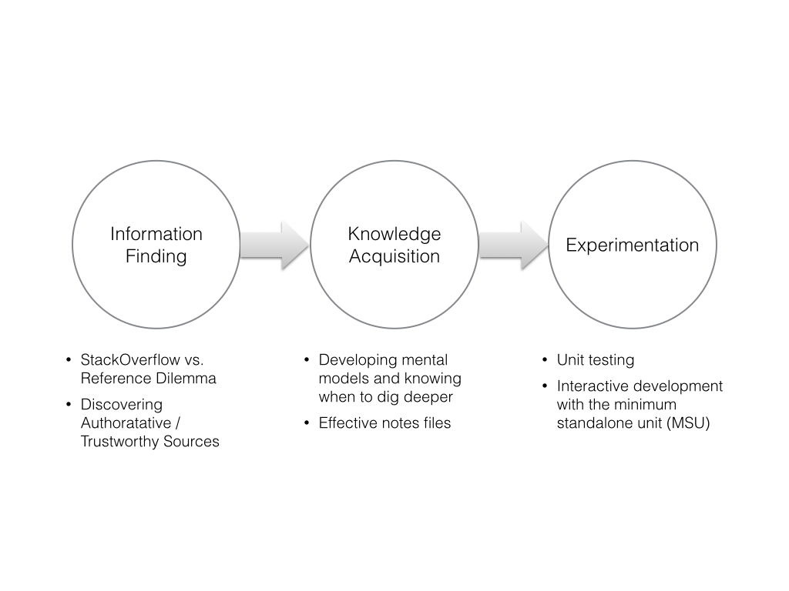
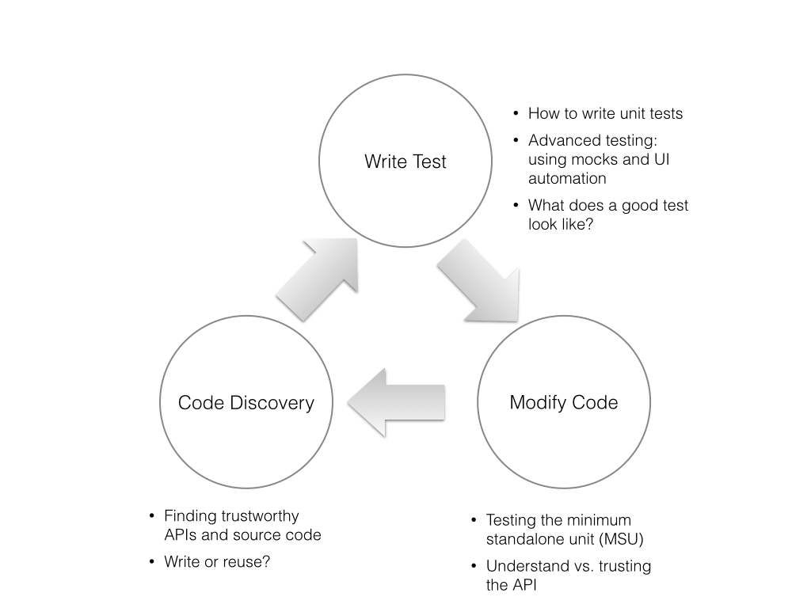

# Vision 3: Instructions for Effective Discovery and Assembly of Code for Beginning Systematic Software Development

## Objective

By adopting systematic techniques for software development, students can improve in two ways:

* By increasing their ability to design and debug with a set of well-understood tools
* By improving the stability of their own projects

Systematic techniques for software engineering can help students ensure longer-term project success and long-term learning of new technologies.

In other words, this workshop is about helping students **channel the systematic developer**, and describes techniques for discovering and learning about code, inspecting code examples, quarantining reusable code and understanding it.
It focuses on the concept of a **minimum standalone unit**, or a piece of code that can be tested on its own so that you can understand its behavior prior to integrating it into a larger body of code.

### Rationale

This course seeks to combat:

* Lack of flexibility of programmers reapplying their knowledge to new use cases
* A perceived lack of repeatability when programmers reuse chunks of code in new places in their software
* The difficulty of debugging libraries and APIs programmers are unfamiliar with

In the process of learning from online sources, we see the following as being an appropriate workflow, with associated challenges:

It's important that in the Information Discovery stage, if students have not yet read any introductory documentation to a package, it's often best to read its introduction and a brief getting-started guide prior to going forward.
Reuse of code without recognizing what it was built for and its range of capabilities can lower our ability to make use of it to its greatest extent.

To systematically reuse code, we propose the following workflow with associated challenges shown next to the nodes:

## Practical deliveries

After participating in this workshop, students will be able to practice:

* Tools for starting to build a personal knowledge file that can be referred to in the future
* Techniques for discovering a useful reusable components of software that they can trust
* For their framework, extracting minimum standalone snippets and testing them prior to integration
* Paradigms for what to test, and what makes a good test

While this workshop will apply to a particular programming language and development environment, students should be advised that these workflows are helpful to systematically developing in any language.

## Tools used

Students will be guided to use:

* Diigo web annotation software
* A unit testing framework for their programming language
* Existing online interfaces for Github and Pypi to better inspect the reliability of code

## What this talk omits

* Integration of software components and integration testing
* Techniques for deploying software to the cloud
* UI development and revision control
* Techniques for analyzing data
* Workflows for learning new languages and APIs altogether
* How to understand unfamiliar algorithms
* Effective system design
