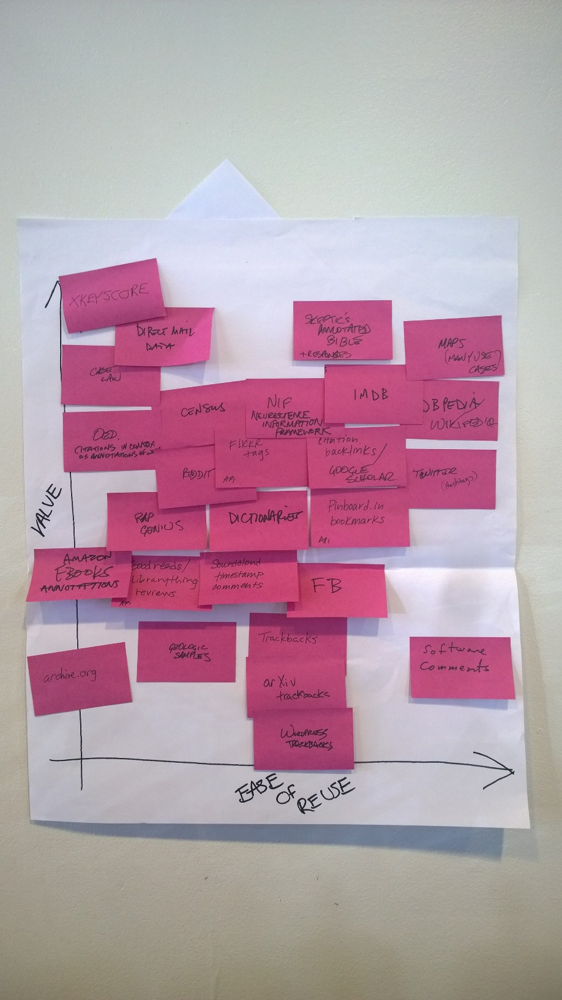

# Vision 6: Brainstorms for Collaborative Work Projects

This is based on [Vision 5](vis5), a document that describes the future of Tutorons.
Out of an intention to extend Tutorons to a larger academic community such as computer-supported collaborative work, this document proposes research that explores frontier, high-impact collaborative work research based on Tutorons.

## Terminology
* AAA: artifact-anchored annotation.  An annotation that is connected to a structured artifact on the web rather than unstructured text.  It can be applied to other artifacts elsewhere on the web that share some pattern with the original marked-up artifact.

## Nuggets of Ideas

The following categories were taken from the "Submitting Papers" section of the CSCW 2016 website.

### Crowd computing
* A pipeline to inspire skilled "angels" to explain and fix online code

### System design
* A system for getting near-instant answers to programming questions on found tutorials
* A system for people to begin conversations on the documents they are on, and for a community to join in on the discussion from intrinsic motivation from a central hub interface
* A tool where companies can make recommendations to each other's business processes by accessing documents on their intranets
* A tool for marking up others 3D prints or videos to help in the revision or ideation process

### Theories and models
* Personas of help-seekers and question answerers in the programming community
* A model for annotating, fleshing out into standalone documents, and indexing them for search by today's major search engines

### Empirical investigations
* A study of artifact-centered communities that could benefit from AAAs
* A literature review of mechanisms for collaborative annotations and the communities that they support (or failed to support)
* An empirical study of "getting stuck" with online documents across domains.  Where is information critical to proceeding in shared documents (either static or hyper).  Domains include learning math concepts, reusing code, software instructions, Instructables
* A study of tutorial authors, their motivations, frustrations, and inefficiencies
* The effort required to make transferable insight annotations: timing, and spread

### Mining and modeling
* Profile of repeated code (and artifact elements) on the web: how many snippets are repeated but just with different variable names
* Profile of explanatory text, reading level, and programming coverage for programming tutorials

### Methodologies and tools
* Toolkit for writing AAAs (or transferable insight annotations), testing web coverage, and improving based on results
* Incentive mechanisms for getting crowd contributions from experts in the zone on their work
* Mark-Me-Up!  A integrable plugin for webpages enabling collaborative markup, re-writing, test cases, and code example uploads.

### CSCW and social computing for underserved populations
* A study of novice programmers on learning together and sharing mental models

### Collaboration systems based on emerging technologies
* Bootstrapping insights and code usability by monitoring the CrowdCode platform

### Crossing boundaries

## Abstracts

### A Toolkit for Composing Adaptive Annotations that Find and Explain Document Fragments Everywhere

Problem: People go through phases of indoctrination to new languages, crafts, and communities (or may be forever on their fringes, such as learning math).  These introductions may be met with frequent requests for clarifications during the person's behavior on the site.  Failure to get questions answered can result in wasted time searching, and in extreme cases dropping projects.
Solution Impact: 10x reduction in the frequency of information access failures.  Decreased frustration in these communities.
Current Approach: Books and tutorials for introductions to the craft.  Practice.  Structured resources.
Current Neglect: The ability of automation (and possibly NLP, site mining, common usage mining) to provide helpful web markups.
Body Neglect: A critical perspective of the value of shared annotations, and a view to how they would be most used for community newbies.
Solution: A toolkit with: ability to quarantine representative documents and learn a model for the document, development of simple explanations AND more complex explanations, and debugging examples for what is found based on the patterns and explanations generated (scrapes)
Construction: Common Crawl search for first round.  Vectorize document based on style, tokens, and number of characters.  Piggy back on an existing system like Hypothes.is or AnnotatorJS to show how this integrates with a larger community
Evaluation: Have people build one for recipe ingredients, a new language, and Python builtins.  Conduct a workshop with 4 people.
Materials: Lots of time!  List of enthusiastic hackers.
Man-Months: 3 months developing prototypes.  1 month workshop.  1 month prototyping.

One of the strengths of this proposal is that it doesn't claim that annotation is just by default of high value.
It also doesn't seek to support people who only occasionally need annotations to satiate some curiosity that could probably be satiated elsewhere.
Instead, it focuses on newbies to communities, a group that probably need frequent help getting to know the terminology and practices of the group, may not find this help readily from online communities, and may not be successful in searching for help to their questions.

## Areas for further exploration

* What crowd annotations systems can be built to support a world where Open Annotation's guidelines are fully implemented in the browser?
* Find evidence for the benefits of online annotations.  When do they actually help people learn or understand material?  Are they better for personal use, and are shared annotations ever relevant?  If most shared annotations are irrelevant, maybe a person could enable certain types of annotations (either community or automatically generated) that they think would helpful to have in general.  If these annotations are available for &gt;80% of the cases where they want clarifications, then they're probably very helpful.
* One thing that annotations can't help out with is a lack of attention and engagement with the material.  Sometimes the best thing to do (evidenced by my attention to the expected value today) is to read the content carefully, write it down, break it down, and synthesize.

## Insights from ideation

Annotations and community discussion is only necessary for when people get stuck.
If there's a lower cost to moving to another document or just abandoning the tasks, people probably won't use collaborations or discussion.
It's only when the information is the element in the critical path to getting a task done that we need to support knowledge sharing.

### Components of the zeitgeist

#### Atmosphere
* millions of programmers have an online presence
* there are millions of online tutorials (of low to high quality)
* there are millions of high-quality online questions and answers
* millions have a drive to build apps, websites, and physical devices

#### Problems
* writing code fast
* debugging code fast
* building and maintaining big systems (e.g., end-user infrastructure development)
* building systems fast
* building visible, high-impact systems
* getting teams together for building systems
* learning conversational programming

#### Technology
* document clustering
* parse tree structure understanding
* natural language understanding
* natural language generation
* crowd production of human insight
* document indexing and search

### Ideas beyond CSCW

* How can we make it more clear when people are uploading code that it shouldn't merely be copied and pasted?  One example is the "replace" example that Matthew found online---for his purposes, he shouldn't have just copied and pasted that code.  He should have read what it did, removed the irrelevant parts of it, and then copied and pasted it.
* How can we synthesize the code that's missing from online tutorials by connecting it to other code?
* How to build an embedded search system that accepts arbitrary code and directs someone to the resources they need to understand each piece?

## Insights from follow-up reading

### Collaborative Annotation Systems

Difficulties in making a pervasive annotation system: annotations have to be something people *need* or else they won't view them. They should also explain relevant content in an accessible way.
There are multiple purposes to annotation systems. To revise. To store knowledge for later access. To vote.

Systems that involve students (e.g., TrACE) may be most indicative of the kinds of challenges Tutorons could encounter across a larger body of documents.
However, one thing that is different about Tutorons is that their users would be exploring online collections of documents as part of a much longer career---their engagement wouldn't end after a class was over, and they wouldn't be engaging with the material for a grade.
In fact, people may all use tutorial material and online help for different reasons.
Maybe one of the tricks is realizing that one of the online help personas simply will not contribute back to the community, but there are one or two that will if engaged in the right way.

There's actually a huge number of collaborative annotation systems that exist today.
See [this one compiled by Hypothes.is](https://docs.google.com/spreadsheets/d/1f86L7vgHUW9wSLNNSunhjmtxtg6KlCOVpHGKbqUzW-Y/edit#gid=0).
One thing that seems different about Tutorons is that Tutorons is as transferable-insight annotation.
**A markup that was generated in one place can be re-applied elsewhere, and adapted to that scenario as well.**
In fact, from the view of CSCW 2015 and this matrix, it seems that Tutorons annotations have the benefit of being applicable to a general public not engaged in a MOOC, while exploring the potential of transferable insights.

Examples of systems currently in wide use include:
Diigo, DocumentCloud, Goodreader, Mendeley, Notable PDF, and RapGenius.

## Related Work

From I Annotate 2015, this is a graph of expected value vs. ease of reusing data sources to pre-populate annotations:

Note that this group expected that software comments may be ease to reuse, but have low value.
