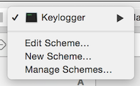
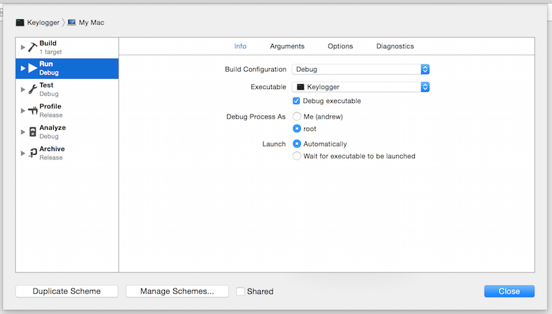

# Prototype 15: Converting syntax trees between languages

## Overview

### Purpose

Programmers working opportunistically use specific languages and tools that they are comfortable with (Brandt et al. 2008).
In some cases, they may not be familiar with the tools that are most appropriate to the task they want to complete.
Examples of this are:
* using new embedded platforms using a different base language (KL25Z vs. Arduino)
* writing bash scripts to automate tasks
* working with (and connecting to) Java code that can use a specific library
* inserting a delay into JavaScript code.
The high barrier to learning to use new tools and languages may make it prohibitive to learn the right tools to make and exploratory task possible.
This prototype builds a couple of simple 'use-anywhere' converters from one programming paradigm to another.

Through building these prototypes, we ask: 
* what is the process that it takes to convert one syntax tree to another?
* does it feel right to have code in one language replaced by code in another?

### Summary

We implemented this code converter tool an it appears to work well!
It is not clear whether it can scale to the many different incomplete or mutated ways people might express code in one language.

## Procedure

### Use case

Possible use cases include:
* Starting working on a programming assignment in a new language (e.g., first Java class, or using VHDL for the first time)
* Writing up bash aliases that iterate over a number of file names
* Opening a file and reading it in Java
* Programming for the GPU for the first time
* Copying a file within Docker
* Making queries to a new company MongoDB
* Making a query to a server with JavaScript, or starting a fileserver with JavaScript, 
* Adding a delay in JavaScript

For this first prototype, we consider a multi-part use case where one is writing a class in a new language that will loop over a set of file names and read a file.
The user is working with Java for the first time, but knows Python.
This task involves the following sub-steps:
* Adding a "main" that will get executed
* Declaring a new class
* Defining a method
* Defining a list
* Reading file contents
* Printing to the screen
* Adding comments

Nell is using Java for the first time.
She needs to run NLP algorithms on some code that are encapsulated in a Java JAR.
She needs to write some boilerplate code for just opening files in the first place from Java---the Python interface is too limited to use, even though she typically uses Python instead of Java.
While she could walk through some tutorials, she knows conceptually what she wants to do and how to express it in *a* programming language, just not the target language.
She has already installed CodeConv, which is running in the background.

Nell opens a file that she calls `main.java`.
She knows that the converter between these two languages is called `pj` for Python-to-Java.
She writes an entry point for expressing code:

    **pj** {if __name__ == '__main__':
        main()
    }

After typing closing curly brace, this expands to:

    // XXX: Make sure to rename this file "Driver.java" so it will compile.
    public class Driver {

        public static void main(String [] args) {
            // Main code goes in here
        }

    }

This includes a pointer to where the next steps go---as you can see, there's a comment that describes where the main code should be placed next.
Before moving on, Nell renames the file to ``Driver.java`` and deletes the comment above.
In a future version, the class name (here, `Driver`) might be provided by Nell, requested through a popup window.

Nell scans the code that has been created and wants to make sure that this code runs right, so she types in:

    **pj** {print "Hello world!"}

After typing the closing curly brace, this expands to

    System.out.println("Hello world!");

Nell then goes to the command line to test out whether the program works.  She types in:

    **pj** {python Driver.java}

This expands to

    javac Driver.java && java Driver

She types enter and sees ``Hello world!`` output to the command line, so she knows that she's on the right track so far.
That means it's time to keep going and try to implement some functionality.
Nell will start by simply reading from one file and writing it's content to the command line:

    **pj** {with open('file1.txt') as file_:
        print file_.read()
    }

which expands to

    // Paste these at the very top of your program in the list of import statements
    import java.io.File;
    import java.nio.file.Paths;
    import java.nio.charset.StandardCharsets;

    String path = "file1.txt";
    byte[] encoded = File.readAllBytes(Paths.get(path));
    String content = new String(encoded, StandardCharsets.UTF_8);
    System.out.println(content);

Nell moves the `import` statements to the top of the file.
She also deletes the statement that prints the message "Hello world!"
Nell tests the program to make sure that it actually reads and prints out the content from `file1.txt`.

Now it's time to define the list of files that Nell wants to have read in.
She wants to cycle through all of the contents of the `data` directory.
She types in the following Python:

    **pj** {files = os.listdir('data/')}

Which expands to 

    // Paste these import statements at the very top of your program in the list of import statements
    import java.io.List;

    File dir = new File("data/");
    List<String> files = new List<String>(Arrays.asList(dir.list()));

Once again, she moves the `import` statement to the top of the file.
Then she wants to iterate through this list:

    **pj** {
        for f in files:
            pass
    }

This expands to:

    // Replace "Object" here with the type that "file" is, if you want to treat it as that
    // class instead of a generic Object.
    for (Object file:files) {
        // Do something
    }

Reading the comment, Nell changes `Object` to `String`.
(By inspecting the types of the Java, it would be possible to iterate through a list of Strings instead of a list of objects.
This is because the type of the `files` variable is declared as a list of Strings.)
She then inserts code for reading the contents of a file that's referenced by its name.

### Construction

This prototype is written by capturing and logging patterns using the OS X library for listening to keypresses.
API Reference: [Quartz Event Services Reference](https://developer.apple.com/library/mac/documentation/Carbon/Reference/QuartzEventServicesRef/index.html#//apple_ref/doc/uid/TP40003550).
We start by simply being able to match `print "Hello world!"` as a string pattern and emitting text for deleting that text and inserting `System.out.println()`.

For now, we develop the command line tool in XCode and gain permissions to run it as root by the following:

First we click on the icon to choose the build target, and choose to "Edit scheme..."

Then at the radio buttons we choose to "Debug Process As" and set this option to "root"

I should run this test by using both the `howdoi` utility as well as our system for replacing content.

### Expected Outcome

It feels pretty natural to see this code put into place, and increases certainty that the code will run (over the copy-and-paste job).

## Notes

### Observations

Technical obstacles we may encounter include:
* Matching the sheer number of possible ways that a programmer could express something like iterating through a loop or opening a file (or providing useful, understandable restrictions that keep programmers only using simple constructs).

### Technical Improvements

It may be too much overhead / too strange of syntax to ask programmers to type in **conv** {} for each code snippet they write up.
This also requires that they remember the name of the converter that they want to use.

In case listening for, deleting and replacing key presses ends up being glitchy in practice, it may be better to just provide users with an easy way to select a block of text and then explicitly submit it for conversion.

It should be relatively easy to do regular expression replacement of strings in the current iteration of the code for prototype 15.

Handle tab as multiple spaces.
And make the system handle auto-indent better.

Some recursion of translation might be helpful, for instance for iterating through a chunk of code (translate the loop, then its body)

### Research Ideas
 
One of the possible contributions of this paper is considering how this context of showing paradigms in place while a programmer makes first attempts can make it more advantageous to point out flaws in applying their mental models to the new language.
*Documentation can be interleaved with the template expansions*, describing how people must follow language conventions like naming variables in a certain place and naming the file after a contained class in the file.
Also, remember that it's important to allow programmers to recall and review what they've learned.
Make their mental models accessible, particularly when they're still getting to know the new language.

An evaluation could include the following conditions:
* Guessing the syntax
* Looking up documentation on the language
* Statement / structure-level replacement
* Full syntax tree replacement 
And like I mention elsewhere in this document, another independent variable could be in-situ documentation provided---in-place or not.

To know what statements should be replaced for programmers, it's important to understand the blocks that they write in and adapt.
Will they use the `with` statement, or just a vanilla `open` on a single line, when opening a file?
One research contribution is coming up with a utility to monitor how programmers write code in the first place.
An exploratory study could establish the types of blocks that programmers write and, at the same time, reaffirm some knowledge about the edit-debug cycle (one loop between writing and verification) from Brandt et al. 2008.
There is likely already a body of work on the atomicity of code that programmers write but, if not, it could be interesting to do anew!

Could there be in-situ comments as one programs that describe the possible side-effects of what one is doing, and suggest quick fixes?
This is already done by error-checking a lot of C and Java code, where errors and potential fixes may be recommended within the IDE.

A possible original contribution could be mining similar code for different languages from StackOverflow (that serves a very similar purpose) and enabling users to insert it.
This condition could be compared to the "howdoi" tool, and using Google searches.
It could still be governed by keystroke so that it could be invoked anywhere.
(One possible problem is that one's environment may not be set up with the right dependencies, at which point, reading through a longer tutorial about setup might be necessary to get local dependencies into the right state.)

If you wanted to make editing and replacement utilities that used nothing but accessibility and low-level input events, how complex can you get?
What are the limitations on developing an integrated development OS based on monitoring input events alone?
Or dod we need to go beyond monitoring these events to more complex, custom user interfaces?

If a user submits a block of text for conversion that is either incomplete or mangled by editing, can we recover what it's supposed to mean?
It would be helpful to be able to parse this code anyway with a lenient parser that inserts the minimum reasonable changes to make the code function.

What are the primitives that opportunistic developers program in?
